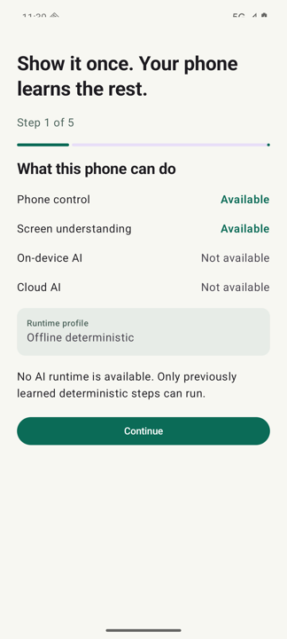
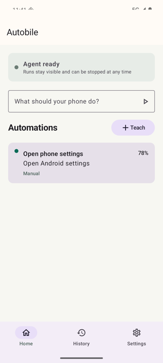
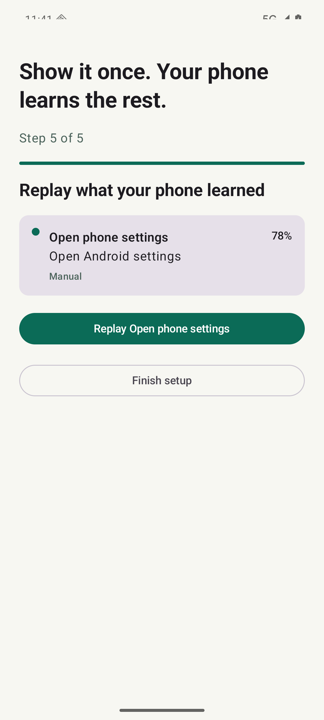
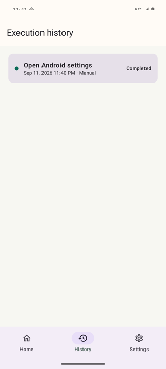

# Autobile

**English** · [한국어](README.ko.md)

Autobile is a device-first Android automation agent. Teach it a routine once by doing
the task on your phone, review what it understood, and replay the learned automation
manually, on a schedule, or in response to a notification.

The runtime prefers the smallest capable execution path: deterministic accessibility
actions first, then on-device inference, an optional local model, and finally an
explicitly enabled cloud provider. Important actions are checked by deterministic risk
policy and every meaningful step is validated against the resulting screen.

<p align="center">
  
  
  
  
</p>

## What works

- Semantic automations that target labels and intent instead of fixed coordinates
- Accessibility-tree perception, screenshots, node actions, gestures, and app launch
- Capability-aware model routing with strict local-only requests and recorded escalation
- Demonstration recording, trace cleanup, intent confirmation, compilation, and replay
- Step and final-goal validation, bounded recovery, repair proposals, and version history
- Manual, time, and notification triggers with boot-time schedule restoration
- Per-app policy, autonomy levels, global stop control, redacted history, and metrics
- Compose onboarding, automation management, execution history, settings, and risk prompts

## Install

Download `app-release.apk` from the [latest release](https://github.com/leestana01/autobile/releases/latest)
and install it. Autobile is not on Google Play; see [Distribution note](#distribution-note).

Releases are signed with the same key, so Android will refuse an update that did not come
from this project. You can check a download before installing it:

```bash
apksigner verify --print-certs app-release.apk
```

The SHA-256 fingerprint is published in each release's notes.

## Requirements

- Android Studio with Android SDK 36
- JDK 21 for local builds and Robolectric tests
- A device or emulator running Android 11 (API 30) or newer

On-device generative features depend on the model support exposed by the specific
device. Autobile detects support at runtime and remains usable for deterministic saved
automations when no model is available.

## Build

Set `sdk.dir` in `local.properties` or configure `ANDROID_HOME`, then run:

```bash
./gradlew assembleDebug
```

The debug APK is written to `app/build/outputs/apk/debug/app-debug.apk`.

## Test

```bash
./gradlew test
```

The test suite uses Robolectric for Android-facing unit tests. Use JDK 21; newer JDKs
may not be supported by the pinned Robolectric release.

Instrumentation tests need a connected device or emulator:

```bash
./gradlew connectedAndroidTest
```

Before changing anything that is serialised or reached reflectively, run them against a
build carrying the real release shrinking rules:

```bash
./gradlew connectedAndroidTest -PautobileTestBuildType=releaseTest
```

Stored automations decode through generated serializers that R8 can remove while the
build still succeeds and every unit test still passes. That failure would surface on a
user's phone after an update, as every automation they taught disappearing.

## Project layout

```text
app/       Compose UI, onboarding, dependency wiring, and user-facing settings
core/      Domain models, privacy-safe storage, policy, history, and metrics
ai/        Provider-neutral inference interfaces, runtime router, and bounded tasks
runtime/   Accessibility, perception, execution, validation, recovery, and triggers
```

The modules intentionally point inward: `app` assembles the process, `runtime` owns the
agent loop, `ai` owns inference boundaries, and `core` has no dependency on either.

## Permissions and privacy

Autobile explains each permission before opening Android settings:

- Accessibility access reads and operates the foreground interface.
- Notification access is needed only for notification-triggered automations.
- Display-over-apps access enables the progress banner and touch indicator.

Cloud assistance is off by default. Text and screenshots have separate consent controls;
screenshots are cropped and sensitive text is masked before an eligible request leaves
the device. Password-manager and authenticator apps are blocked by default, and unknown
apps require confirmation.

## Distribution note

Android accessibility policy and store rules change over time. Review the current
distribution policy before publishing a build that can plan and operate tasks across
other apps. Private testing and direct release channels may be more appropriate for the
full runtime than a general-purpose store listing.

## Project status

Early. The core loop — teach, confirm, compile, replay, validate, repair — works and is
covered by 173 unit tests plus instrumentation tests that run against the shrunk build on
a device. On-device generative features depend on hardware support that varies widely,
and the reliability of learned automations across third-party apps has not been measured
at scale. Treat this as something to try and report back on, not as something to depend
on unattended.

## Contributing

See [CONTRIBUTING.md](CONTRIBUTING.md) for setup, testing and the standards a change is
held to. Bug reports and feature requests are welcome through
[issues](https://github.com/leestana01/autobile/issues).

Please report anything that could be used against a running install privately — see
[SECURITY.md](SECURITY.md).

## License

[Apache 2.0](LICENSE).
